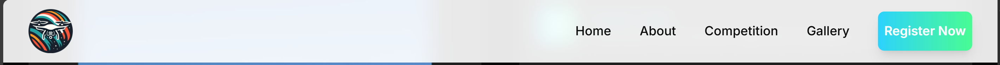
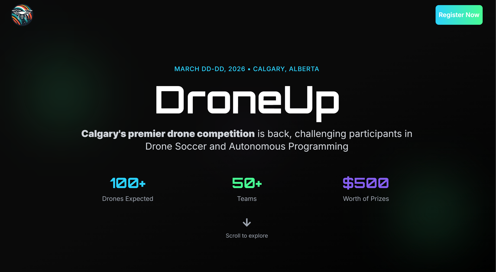
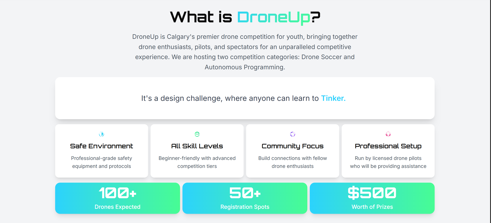
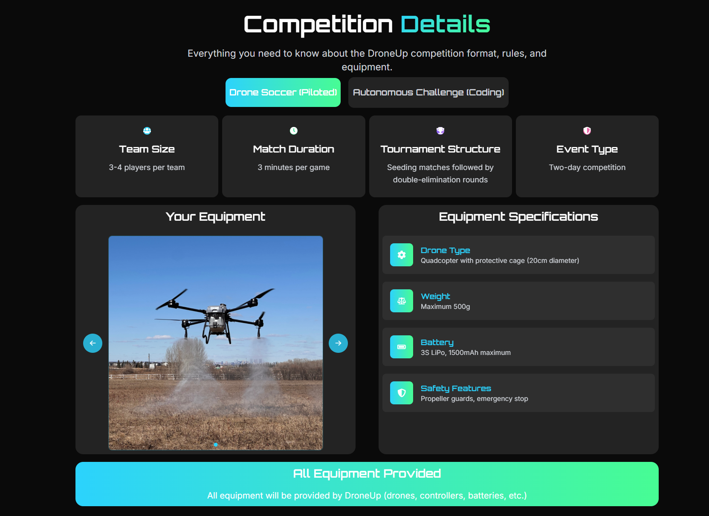
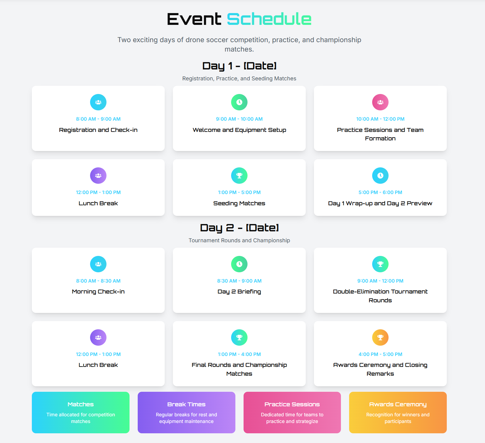
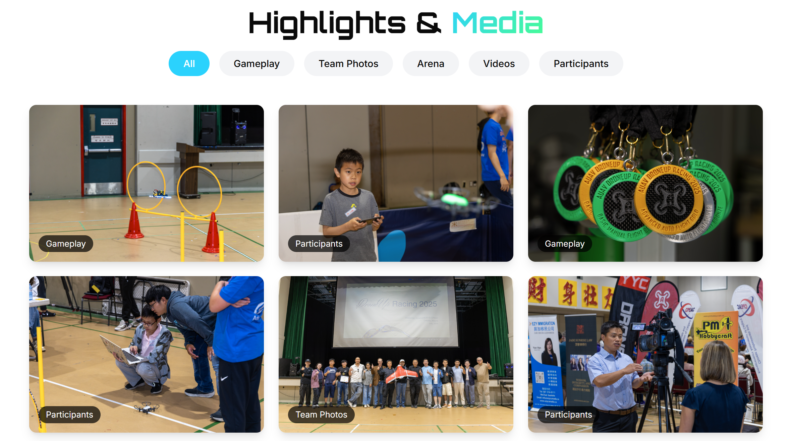
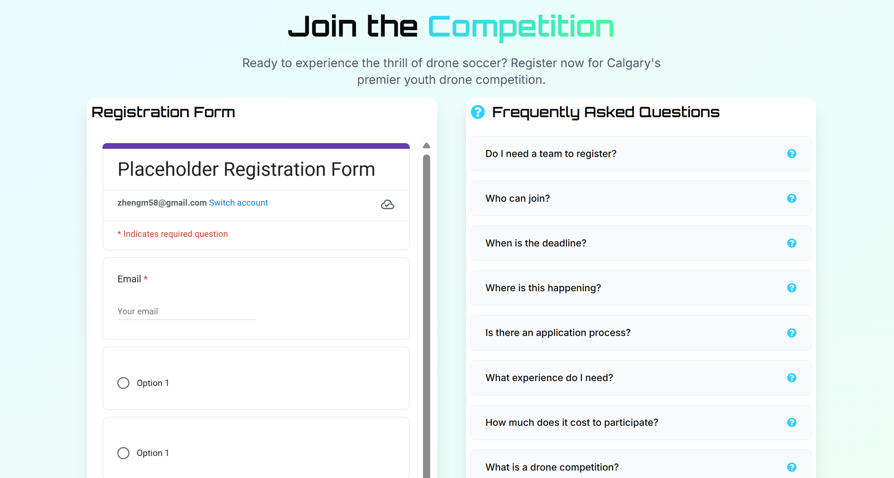
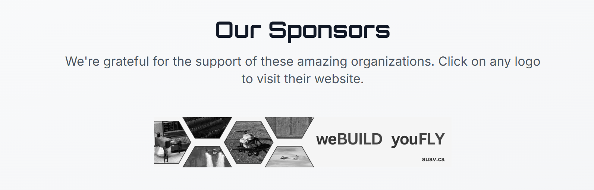
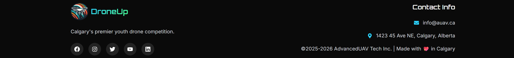

- To change the items in the navbar, go to `src/components/Navbar.tsx`
---

- To change this page's contents, go to `src/components/HeroSection.tsx`
---

- To change this page's contents, go to `src/components/AboutSection.tsx`
	- Change the blue text with the "typewriter" effect: https://github.com/AdvancedUAV/DroneUp-Site/blob/cec8e4c4af01d572ae18be999d33391c6c71870f/src/components/AboutSection.tsx#L21
	- Change the 4 info cards: https://github.com/AdvancedUAV/DroneUp-Site/blob/cec8e4c4af01d572ae18be999d33391c6c71870f/src/components/AboutSection.tsx#L63C1-L63C3
	- Change the three statistics cards w/ gradient background: https://github.com/AdvancedUAV/DroneUp-Site/blob/cec8e4c4af01d572ae18be999d33391c6c71870f/src/components/AboutSection.tsx#L90
---

- Note there are 2 sections in this page: drone soccer AND autonomous challenge that are swithced between with the button at the top of the page
- All the stats AND the drone preview can be changed in `src/data/CompetitionData.ts`
	- Drone preview photos should go in the `public/images` folder
- Equiptment note https://github.com/AdvancedUAV/DroneUp-Site/blob/cec8e4c4af01d572ae18be999d33391c6c71870f/src/components/CompetitionSection.tsx#L148
---

- `src/data/CompetitionData.ts`
---

- Add new images in https://github.com/AdvancedUAV/DroneUp-Site/blob/cec8e4c4af01d572ae18be999d33391c6c71870f/src/components/GallerySection.tsx#L16
	- Each image should be tagged in a category ('Gameplay', 'Team Photos', 'Arena', 'Videos', 'Participants')
---

- Edit the FAQ in https://github.com/AdvancedUAV/DroneUp-Site/blob/cec8e4c4af01d572ae18be999d33391c6c71870f/src/components/RegistrationSection.tsx#L14
- The signup form is a **embed** of a Google Forms link. Make your own google forms, share it, and copy the alphanumeric code and put it into https://github.com/AdvancedUAV/DroneUp-Site/blob/cec8e4c4af01d572ae18be999d33391c6c71870f/src/components/RegistrationSection.tsx#L88
	- Example: Say your google forms link had the url `https://docs.google.com/forms/d/e/1FAIpQLSeMQLwFCpZpNODS01zCtyPuWYhD1u53dMZMttpSbaVSa13_kw/closedform`. Copy the **1FAIpQLSeMQLwFCpZpNODS01zCtyPuWYhD1u53dMZMttpSbaVSa13_kw** part and paste it into the code so that it becomes `src="https://docs.google.com/forms/d/e/1FAIpQLSeMQLwFCpZpNODS01zCtyPuWYhD1u53dMZMttpSbaVSa13_kw/viewform?embedded=true"`
---

- Add each sponsor in the list at https://github.com/AdvancedUAV/DroneUp-Site/blob/cec8e4c4af01d572ae18be999d33391c6c71870f/src/components/SponsorsSection.tsx#L10
	- Include the sponsor's name, a link to their logo, and a link to their website
---

- `src/components/Footer.tsx`